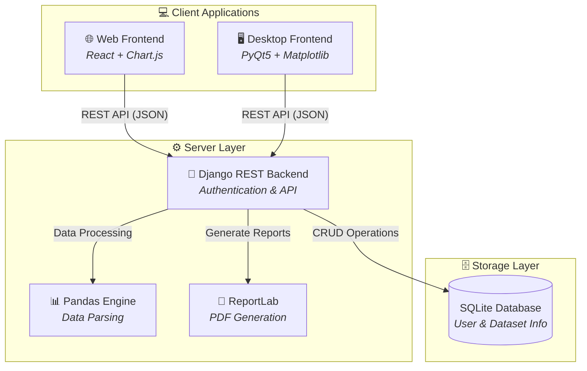
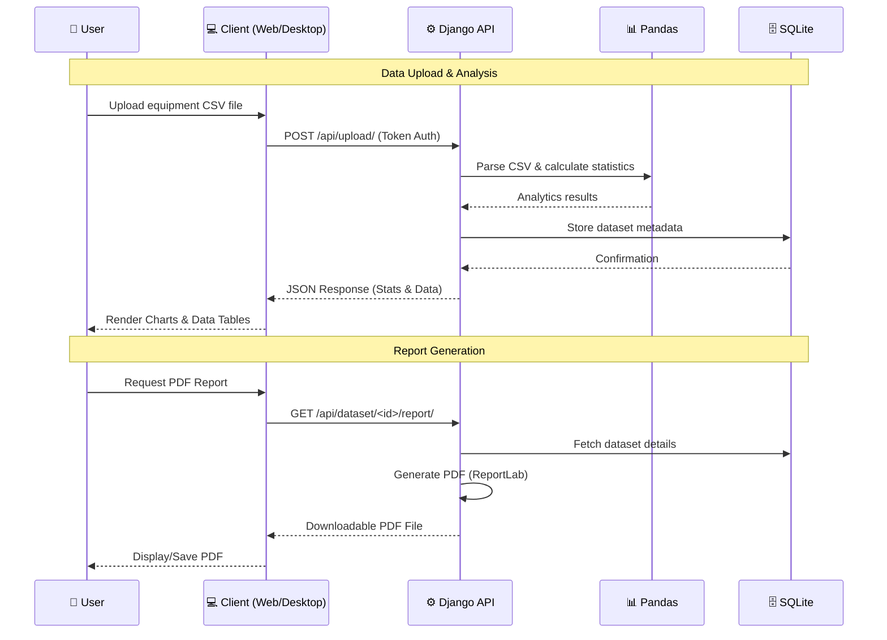

<div align="center">

# 🧪 ChemViz — Chemical Equipment Parameter Visualizer

### A hybrid web and desktop application for uploading, analyzing, and visualizing chemical equipment data.

[](https://www.python.org/)
[](https://www.djangoproject.com/)
[](https://react.dev/)
[](https://riverbankcomputing.com/software/pyqt/)
[](https://www.sqlite.org/)

[🌐 Web App](#) · [🖥️ Desktop App](#) · [🔌 Backend API](#)

</div>

---

## 📌 About

**ChemViz** is an advanced data visualization and analysis tool built for chemical engineering parameters. It offers a seamless experience across both a browser-based web application and a native desktop interface. Both clients connect to a centralized Django REST backend that handles secure authentication, robust CSV data processing using Pandas, and automated PDF report generation.

---

## ✨ Features

### 📊 Data Processing & Analytics
- **CSV Uploads** — Easily upload equipment parameter datasets for immediate parsing.
- **Statistical Summaries** — Automatic calculations and aggregations powered by Pandas.
- **Historical Tracking** — Securely store and retrieve the last 5 uploaded datasets per user.
- **PDF Report Generation** — Export comprehensive analysis reports via ReportLab.

### 🌐 Web Dashboard (React)
- Browser-based interactive dashboards.
- Dynamic charts and visualizations built with **Chart.js**.
- Fully responsive design for accessible analytics.

### 🖥️ Native Desktop Interface (PyQt5)
- High-performance native desktop application.
- Granular table views and powerful plotting via **Matplotlib**.
- Shared authentication state with the web ecosystem.

### 🔐 Security & Backend
- **Token-based Authentication** ensuring secure API access.
- Centralized SQLite database for streamlined local deployments.

---

## 🏗️ System Architecture



---

## 🔄 Request Flow



---

## 🛠️ Tech Stack

| Layer | Technology | Purpose |
|:---:|:---|:---|
| **Backend** | Django, Django REST Framework | API, authentication, business logic |
| **Data Processing** | Pandas | CSV parsing and analytics |
| **Database** | SQLite | Dataset storage |
| **Reports** | ReportLab | PDF report generation |
| **Web Frontend** | React, Chart.js | Interactive browser dashboards |
| **Desktop Frontend**| PyQt5, Matplotlib | Native desktop visualization |
| **Authentication** | Token-based Auth | Secure API access |

---

## 📂 Project Structure

```text
ChemViz/
├── backend/                   # Django REST API
│   ├── chemical_project/      # Main Django project config
│   ├── equipment_api/         # API app for endpoints
│   ├── manage.py              # Django entrypoint
│   └── requirements.txt       # Python dependencies
├── frontend_web/              # React Web Application
│   ├── public/
│   ├── src/
│   └── package.json           # Node dependencies
├── frontend_desktop/          # PyQt5 Desktop Application
│   ├── app.py                 # Desktop app entrypoint
│   └── requirements.txt       # Python dependencies
├── sample_equipment_data.csv  # Sample dataset for testing
└── README.md
```

---

## 🔌 API Reference

### Authentication Endpoints

| Method | Endpoint | Description |
|:---:|:---|:---|
| `POST` | `/api/auth/register/` | Register a new user |
| `POST` | `/api/auth/login/` | Login and receive auth token |

### Equipment Data Endpoints (Requires Token)

| Method | Endpoint | Description |
|:---:|:---|:---|
| `POST` | `/api/upload/` | Upload CSV dataset |
| `GET` | `/api/history/` | List last 5 uploaded datasets |
| `GET` | `/api/dataset/<id>/` | Retrieve dataset details and stats |
| `DELETE`| `/api/dataset/<id>/delete/` | Delete dataset |
| `GET` | `/api/dataset/<id>/report/` | Download PDF report |

---

## 🚀 Getting Started

### Prerequisites
- Python 3.9+
- Node.js 18+ and npm

### 1. Backend Setup (Django)

```bash
cd backend
python -m venv venv
# Windows: venv\Scripts\activate
source venv/bin/activate
pip install -r requirements.txt
python manage.py makemigrations
python manage.py migrate
python manage.py runserver
```
> Backend runs at: `http://localhost:8000`

### 2. Web Frontend Setup (React)

```bash
cd frontend_web
npm install
npm start
```
> Web app runs at: `http://localhost:3000`

### 3. Desktop Frontend Setup (PyQt5)

```bash
cd frontend_desktop
python -m venv venv
# Windows: venv\Scripts\activate
source venv/bin/activate
pip install -r requirements.txt
python app.py
```

---

## 🤝 Contributing

Contributions are welcome!

1. Fork the repository
2. Create your feature branch (`git checkout -b feature/AmazingFeature`)
3. Commit your changes (`git commit -m 'Add some AmazingFeature'`)
4. Push to the branch (`git push origin feature/AmazingFeature`)
5. Open a Pull Request

---

## 📄 License

This project is open source and available under the [MIT License](LICENSE).

---

<div align="center">

**Built with ❤️ by [Ziaur Rahman](https://github.com/iZiaur)**

⭐ Star this repo if you found it helpful!

</div>
